<div align="center">


<br/>

[](https://rolan-rnr.netlify.app/)
&nbsp;
[](https://github.com/Mrtracker-new)
&nbsp;
[](https://www.linkedin.com/in/rolan-lobo-93368a239/)
&nbsp;
[](mailto:rolanlobo901@gmail.com)


</div>

---

## 🧠 About Me

```python
class RolanLobo:
    role        = "Python Developer & Open Source Builder"
    location    = "India 🇮🇳"
    focus       = ["Cryptography 🔐", "Steganography 🖼️", "Security Tools 🛡️"]
    learning    = ["Rust 🦀", "Docker 🐳", "Zero-Knowledge Proofs 🔏"]
    open_to     = ["Collaboration", "Security Roles", "Remote Work"]
    philosophy  = "Privacy-First, Always. Secure by Design."
```

I'm a privacy-focused software engineer who builds open-source tools that protect digital freedoms. My work sits at the intersection of **cryptography**, **steganography**, and **practical security engineering** — turning complex concepts into tools real people can use.

---

## 🛠️ Tech Stack

<div align="center">

**Languages**

[](https://skillicons.dev)

**Tools & Platforms**

[](https://skillicons.dev)

</div>

### 💡 What I Do

| | |
|---|---|
| 🔨 **Build CLI & desktop tools** | Python apps people can actually download and run |
| 🔐 **Hide & protect data** | Steganography tools that conceal files inside images |
| 🌐 **Ship web projects** | From landing pages to full portfolio sites |
| 📦 **Write clean, open-source code** | Readable, documented, and free for everyone |
| 🛡️ **Think about security** | Every project is built with privacy in mind |

---

## 📊 GitHub Stats

<div align="center">



</div>

<div align="center">



</div>

---

## 🎯 What I'm Looking For

<div align="center">

| 🤝 Collaborations | 💼 Opportunities | 🔭 Exploring |
|---|---|---|
| Open-source privacy tools | Security engineering roles | Zero-knowledge proofs |
| Anti-surveillance projects | Privacy-focused positions | End-to-end encryption |
| CTF & security research | Remote-friendly teams | Decentralized tech |

</div>

---

<div align="center">

### 📂 See My Full Work

**[Visit My Portfolio →](https://rolan-rnr.netlify.app/)** &nbsp;|&nbsp; Detailed projects, experience & achievements

<br/>

*"The price of privacy is eternal vigilance."*


</div>
